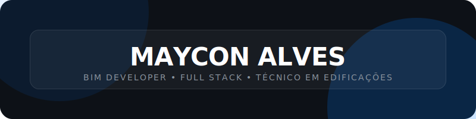

  

 

  <h3>BIM Developer | Full Stack AEC Tech Specialist | Building Technician</h3>
  
<strong>Driven by code. Built for production. Bridging BIM and Software Engineering.</strong>

  
  
   
  
Currently serving a full-time mission for <strong>The Church of Jesus Christ of Latter-day Saints</strong> (2026-2028).

---

### 🚀 Highlight Project

  

> **[EcoBIM-Logic](https://github.com/MayconAlvesss/EcoBIM-Logic)** is a real-time BIM-to-LCA data orchestrator for embodied carbon and ESG metrics. It enables automated, high-fidelity sustainable design analysis directly within the AEC workflow.

---

### 📂 The AEC Tech Ecosystem

#### 🚀 Implementation Active
| Platform | Domain | Core Technologies | Status |
| :--- | :--- | :--- | :-- |
| **[EcoBIM-Logic](https://github.com/MayconAlvesss/EcoBIM-Logic)** | LCA Orchestration | `Python`, `Revit API`, `FastAPI` | Production |
| **[production-dashboard-ai](https://github.com/MayconAlvesss/production-dashboard-ai)** | AI Analytics | `Vite`, `Firebase`, `Gemini AI` | Stable |
| **[BIM-Lawyer](https://github.com/MayconAlvesss/BIM-Lawyer)** | Normative Audit | `LangChain`, `LLM` | Research |

#### 🧪 Architecture & Vision (Concept / Scaffold)
*Concepts to be fully implemented post-mission (2028+)*

| Platform | Domain | Core Technologies | Description / Vision |
| :--- | :--- | :--- | :--- |
| **[Nexus-Twin](https://github.com/MayconAlvesss/Nexus-Twin)** | Digital Twin | `React`, `Three.js` | Modular IoT Digital Twin framework for real-time facility management. |
| **[AuraVision](https://github.com/MayconAlvesss/AuraVision)** | Computer Vision | `OpenCV`, `Python` | Forensic visual analysis of structural pathological conditions on-site. |
| **[OpenIFC-DataWrangler](https://github.com/MayconAlvesss/OpenIFC-DataWrangler)** | Interoperability | `ifcopenshell`, `SQL` | High-performance openBIM data extraction and relational mapping. |
| **[SiteSense-AR](https://github.com/MayconAlvesss/SiteSense-AR)** | Reality Capture | `WebXR`, `Three.js` | Mobile-first WebXR overlay for on-site BIM model alignment and checking. |
| **[AECAgent-RAG](https://github.com/MayconAlvesss/AECAgent-RAG)** | AI Intelligence | `LangChain`, `Gemini` | Intelligent RAG agent for international technical normative retrieval. |
| **[BIM-to-Graph](https://github.com/MayconAlvesss/BIM-to-Graph)** | Data Structures | `NetworkX`, `Python` | Topological building analysis via graph theory and relationship mapping. |

---

### 🛠️ Tech Stack & Tooling

  
  
  
  
   
  
  
  
  
   
  
  
  
  

---

### 📊 Engineering Stats

  
  
  
  

 

---

  Full Stack BIM Developer | 2026-2028 Mission Commitment | AEC Innovation Enthusiast
   
   
  
  

