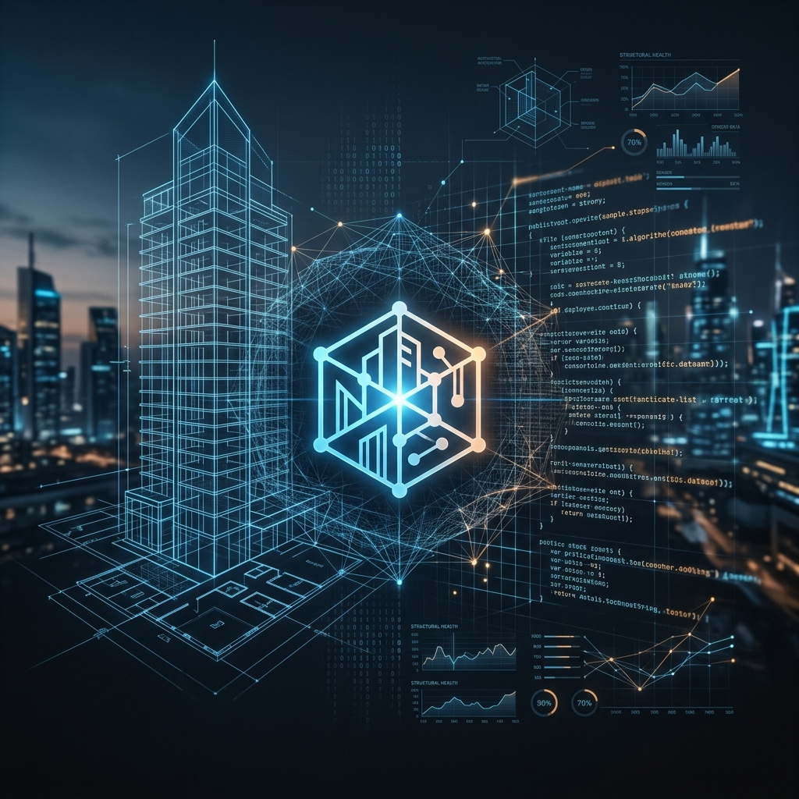

  
  
  <h1>Hi there, I'm Maycon Alves 👋</h1>
  
  

    <strong>BIM Software Specialist | Digital Twin Engineer | AI Enthusiast</strong>
  

  

    
    
     
  

---

### 🏗️ About Me
I am a **BIM System Developer** dedicated to bridging the gap between physical construction and digital intelligence. I build high-performance Digital Twins, Forensic Computer Vision engines, and Automate Rule Checking (ARC) systems to modernize the structural engineering lifecycle.

---

### 🚀 Featured Ecosystem (Nexus-Twin)

| Project | Description | Stack |
| :--- | :--- | :--- |
| **[Nexus-Twin](https://github.com/MayconAlvesss/Nexus-Twin)** | 3D Structural Health Monitoring & Predictive Analysis platform. | React, Three.js, Python, ML |
| **[AuraVision](https://github.com/MayconAlvesss/AuraVision)** | Forensic Computer Vision & LiDAR engine for pathology diagnostics. | OpenCV, Scikit-Image, Plotly |
| **[BIM-Lawyer](https://github.com/MayconAlvesss/BIM-Lawyer)** | Autonomous normative auditor using LLM-RAG and IBC codes. | LangChain, FastAPI, IBC 2021 |

---

### 💻 Tech Stack & Tools

  
  
  
  
  
  
  

---

### 📊 GitHub Activity Snapshot

  
  

---

  Built with ❤️ by Maycon's Nexus Assistant. Dedicated to Engineering excellence.

